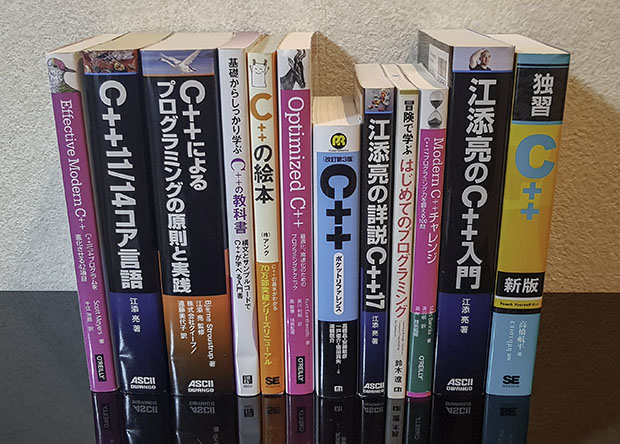

description: モダン C++ の学習に役立つ書籍の紹介

# C++ 書籍

C++ の学習に役立つ最新の書籍を紹介します。  
初学者向けの入門書には :fontawesome-solid-graduation-cap: マークを付けています。
<!-- C++14 以降を扱っているもの。書籍記載の発行年月日が古い順 -->
<!-- プログラミング未経験者でも読みやすい書籍には :fontawesome-solid-graduation-cap: マーク -->

## C++14 以降を扱った書籍

| 書名                                                                     | 発行年  | C++ 規格   | 内容                                                                                             |
|------------------------------------------------------------------------|------|----------|------------------------------------------------------------------------------------------------|
| [Effective Modern C++](https://amzn.to/2H8bnnF)                        | 2015 | C++14    | Effective C++ で有名な Scott Meyers による C++11/14 のガイドライン・コーディングスタイル・イディオム集                         |
| [C++11/14 コア言語](https://amzn.to/2HmyYQP)                               | 2015 | C++14    | C++11/14 の文法と言語機能を規格書に基づいて詳細に解説。[オープンソース版 :material-open-in-new:](https://github.com/EzoeRyou/cpp-book){:target="_blank"}               |
| [組込みソフトウェア開発向けコーディング作法ガイド C++ 言語版 Ver.2.0](https://www.ipa.go.jp/publish/secbooks20161001.html) | 2016 | C++14 | 基礎を学んだ人向けのコーディングスタイル本。組み込み向けの厳格さもあるが概ね汎用的。PDF 版は無料公開 |
| [C++ によるプログラミングの原則と実践](https://amzn.to/2Hmzazx)                        | 2016 | C++14    | C++ を使ってプログラミングを教える 1,000 ページ超の入門書。C++ 生みの親 Bjarne Stroustrup 著                                |
| [基礎からしっかり学ぶ C++ の教科書](https://amzn.to/2IXa1hf)                         | 2017 | C++14    | C++ の基本的な文法からクラス、コンテナ、並列化など様々な機能を 300 ページに圧縮して紹介する入門書                                |
| [C++ の絵本 第２版](https://amzn.to/2TFvvTO)                                 | 2017 | C++14    | クラスや参照、テンプレートなど、C に対する C++ 固有の言語機能を図版を用いて解説                                                    |
| [Optimized C++](https://amzn.to/2Ho1KjN)                               | 2017 | C++14    | C++ プログラムの性能測定と最適化についての実践と解説                                                                   |
| [[改訂第3版] C++ ポケットリファレンス](https://amzn.to/2H8a3kH)                      | 2018 | C++17    | 基本文法の解説に加え、逆引き形式で標準ライブラリの幅広い機能を紹介                                                              |
| [江添亮の詳説 C++17](https://amzn.to/2HmVw42)                                | 2018 | C++17    | C++14/17 の新しい文法と標準ライブラリ機能を詳細に解説。[オープンソース版 :material-open-in-new:](https://ezoeryou.github.io/cpp17book/){:target="_blank"}              |
| [冒険で学ぶはじめてのプログラミング](https://amzn.to/2IWnWnx)                           | 2018 | C++17    | :fontawesome-solid-graduation-cap: 未経験者向け。早稲田大学が運営する中学・高校生向け C++ 入門講座の教科書。[紹介ページ :material-open-in-new:](https://enrect.org/cppbook/){:target="_blank"} |
| [Modern C++ チャレンジ ― C++17 プログラミング力を鍛える 100 問](https://amzn.to/2EMsIP8) | 2019 | C++17/20 | 現実的・実践的な 100 の課題を C++ で解決する問題集。オープンソースライブラリを積極的に活用する                                           |
| [江添亮の C++ 入門](https://amzn.to/2HTGUbt) | 2019 | C++17/20 | C++ のツールや文法、いくつかの標準ライブラリ機能の設計を学べる解説書。[オープンソース版 :material-open-in-new:](https://ezoeryou.github.io/cpp-intro/){:target="_blank"} |
| [独習 C++ 新版](https://amzn.to/2ZWRrck) | 2019 | C++17 | :fontawesome-solid-graduation-cap: 初学者向け。「独習 C++ 第 4 版」を C++17 に対応させ解説を一新 | 
| [[改訂第4版] C++ ポケットリファレンス](https://amzn.to/3p4p0pa) | 2021 | C++20 | 基本文法の解説に加え、逆引き形式で標準ライブラリの幅広い機能を紹介 | 
| [C++ ソフトウェア設計 - 高品質設計の原則とデザインパターン](https://amzn.to/3tI3puI) | 2023 | C++20 | モダン C++ における設計技法やデザインパターンなど 39 項目を解説。[目次 :material-open-in-new:](https://www.oreilly.co.jp/books/9784814400454/){:target="_blank"} | 

## C++ 入門書の選び方

### [冒険で学ぶ はじめてのプログラミング](https://amzn.to/2IWnWnx)
3 日間コースの中高生向け C++ 教室で使われている教科書です。モダン C++ をベースに入門レベルの内容 (標準入出力、変数、if-else, for, 乱数、std::vector など）を扱っています。無理のないペースと物語形式の題材で、挫折せずにプログラミングに慣れることができるのが特長です。C++ は厚い本が多いなか、約 180 ページと手軽なので、完全読破をして自信をつけて次のステップに進むのに適した最初の一冊です。

### [やさしい C++ 第 5 版](https://amzn.to/3j9pVTD)
C++ の入門～中級レベルの内容のうち、基本的な部分（『冒険で学ぶ はじめてのプログラミング』に加え、関数、ポインタ、クラス、ファイルなど）を取り上げて、豊富な図を交えて説明しています。学習する順番も適切にデザインされていて親切です。約 550 ページと分量は多いですが、情報系の専門 / 高専 / 大学生が C++ を使えるよう、腰を据えて独学するのに最適な一冊です。C++11 以降の範囲 for や新しい標準ライブラリなど、モダンな機能への言及が少ない点には注意が必要です。

### [独習 C++ 新版](https://amzn.to/2ZWRrck)
独学のための十分なサンプルと説明が掲載されている入門書で、C++11～C++17 の機能も多く登場します。『やさしい C++ 第 5 版』では扱っていないラムダ式や右辺値参照、また簡単な紹介にとどまっていたテンプレートや例外、データ構造などをしっかり解説しています。序盤からやや高度なトピックも登場するため、未経験からこの本を読み始めるのは少し大変かもしれません。

### [C++ の絵本 第２版](https://amzn.to/2TFvvTO)
C 言語から C++ にステップアップするうえで新しく覚える必要のある内容（クラス、名前空間、参照、継承、テンプレートなど）に焦点を当て、豊富な図解でまとめています。一方で、それ以外の基本的な文法については説明を省いているため、ある程度の経験者が対象です。"Better C" 的なコードしか書けない人が「C++ らしい」コードを書けるようになるための重要な情報がまとめられています。

### [基礎からしっかり学ぶ C++ の教科書](https://amzn.to/2IXa1hf)
C++ の入門～中級レベルの多くの情報（『やさしい C++ 第 5 版』に加え、例外や並列処理）を、約 300 ページに効率よく圧縮して紹介しています。少しだけ C++ を使ったことのある人や、C 言語に慣れている人が、短時間で C++ の主要機能をインプットするのに向いています。

### [江添亮の C++ 入門](https://amzn.to/2HTGUbt)
古い C++ を学習した人が、最新の C++ の流儀に再入門するのに適した入門書です。

### [[改訂第4版] C++ ポケットリファレンス](https://amzn.to/3p4p0pa)
掲載されている C++ の機能の数は断トツのトップクラスです。総ページのうち大部分が標準ライブラリ機能の解説ですが、100 ページ以上ある第 2 章では C++ の言語機能も網羅的に解説しています（図などは無く、抜粋のコードがほとんどなので初学者にはやや難しいです）。入門書というよりも辞書的な性格が強い本です。ある程度 C++ の経験を積んでからもお世話になる本です。

## 洋書
| 書名                                                                                                                     | 発行年  | C++ 規格   | 内容                                                                                                                                                                                   |
|------------------------------------------------------------------------------------------------------------------------|------|----------|--------------------------------------------------------------------------------------------------------------------------------------------------------------------------------------|
| [C++ Templates: The Complete Guide (2nd Edition)](https://amzn.to/2TnVa4h)                                             | 2017 | C++17/20 | C++17 のテンプレートの文法や様々なテクニックを解説。C++20 で導入されるコンセプトの紹介も。 [目次](https://www.oreilly.com/library/view/c-templates-the/9780134778808/)                                                        |
| [Mastering the C++17 STL](https://amzn.to/2tYz4X1)                                                                     | 2017 | C++17    | C++17 までの標準ライブラリの機能や使い方を紹介。[目次](https://www.packtpub.com/application-development/mastering-c17-stl)                                                                                  |
| [Professional C++, 4th Edition](https://amzn.to/2Ov3SJ9)                                                               | 2018 | C++17    | [目次](https://www.wiley.com/en-jp/Professional+C++,+4th+Edition-p-9781119421306)                                                                                                      |
| [Functional Programming in C++: How to improve your C++ programs using functional techniques](https://amzn.to/3iZFOf5) | 2018 | C++17    | C++ における関数型プログラミングを豊富な図で解説。[目次とプレビュー](https://www.manning.com/books/functional-programming-in-c-plus-plus)                                                                           |
| [C++ Concurrency in Action, Second Edition](https://amzn.to/2J2y26G)                                                   | 2019 | C++17    | C++17 における並行処理を詳細に解説。ロックフリーデータ構造の設計なども取り上げる。[試し読み](https://www.manning.com/books/c-plus-plus-concurrency-in-action-second-edition)                                                   |
| [C++17 in Detail](https://leanpub.com/cpp17indetail)                                                                   | 2019 | C++17    | C++17 の主要な新機能・変更点のほか、Boost から標準ライブラリへの移行を解説。[目次](https://leanpub.com/cpp17indetail)                                                                                                  |
| [C++17 - The Complete Guide](http://www.cppstd17.com/)                                                                 | 2019 | C++17    | [目次](http://www.cppstd17.com/)                                                                                                                                                       |
| [C++ Crash Course: A Fast-Paced Introduction](https://amzn.to/395CtqL)                                                 | 2019 | C++17    | （調査中）                                                                                                                                                                                |
| [Advanced C++ Programming Cookbook](https://amzn.to/3fFA88f)                                                           | 2020 | C++20    | [目次](https://www.packtpub.com/programming/advanced-c-cookbook) / [サンプルコード](https://github.com/PacktPublishing/Advanced-CPP-Programming-CookBook)                                     |
| [C++ System Programming Cookbook](https://amzn.to/3jfdoxU)                                                             | 2020 | C++20    | [目次](https://www.packtpub.com/programming/c-system-programming-cookbook) / [サンプルコード](https://github.com/PacktPublishing/C-System-Programming-Cookbook)                               |
| [Expert C++](https://amzn.to/2WsxY49)                                                                                  | 2020 | C++20    | [目次](https://www.packtpub.com/programming/mastering-c-programming) / [サンプルコード](https://github.com/PacktPublishing/Expert-CPP)                                                        |
| [C++ Lambda Story](https://amzn.to/3qLsbF8)                                                                            | 2020 | C++20    | モダン C++ におけるラムダ式の機能やその変遷、ラムダ式の活用テクニックを解説。[目次](https://leanpub.com/cpplambda)                                                                                                         |
| [The C++ Standard Library](https://leanpub.com/cpplibrary)                                                             | 2020 | C++20    | C++20 までの標準ライブラリ機能を解説。[目次](https://leanpub.com/cpplibrary)                                                                                                                           |
| [C++ Move Semantics - The Complete Guide: First Edition](https://amzn.to/3fTLgiM)                                      | 2020 | C++20    | C++ のムーブセマンティクスを解説。[目次](http://www.cppmove.com/)                                                                                                                                     |
| [Modern C++ Programming Cookbook, 2nd Edition](https://amzn.to/3naUMQs)                                                | 2020 | C++20    | C++11～C++20 のモダンな機能の使い方を解説。パターンやイディオム、Boost.Test, Google Test, Catch2 を使ったテスト手法も扱う。[目次](https://www.packtpub.com/product/modern-c-programming-cookbook-second-edition/9781800208988) |
| [Beginning C++20: From Novice to Professional Sixth Edition](https://amzn.to/3qHFZRb)                                  | 2020 | C++20    | C++20 に基づいた C++ プログラミング入門書。853 ページ。[目次](https://link.springer.com/book/10.1007/978-1-4842-5884-2)                                                                                    |
| [C++ Best Practices: 45ish Simple Rules with Specific Action Items for Better C++](https://amzn.to/3paeX2R)            | 2021 | C++20    | より良い C++ コーディングのための 45 個のルールを説明。[目次](https://leanpub.com/cppbestpractices)                                                                                                           |
| [Professional C++, 5th Edition](https://amzn.to/3bKXqdH)                                                               | 2021 | C++20    | 2018 年に発売された『Professional C++, 4th Edition』の C++20 対応版。1312 ページ                                                                                                                      |
| [C++20: Get the Details](https://leanpub.com/c20)                                                                      | 2021 | C++20/23 | C++20 の新機能を 500 ページにわたって解説。[目次](https://leanpub.com/c20)                                                                                                                             |
| [Beautiful C++: 30 Core Guidelines for Writing Clean, Safe, and Fast Code](https://amzn.to/3JyIoX5)                    | 2021 | C++20    | C++ Core Guidelines のうち特に重要な 30 項目について、実践的なサンプルや解説を提供。[目次](https://www.oreilly.com/library/view/beautiful-c-30/9780137647767/) / [サンプルコード](https://godbolt.org/z/cg30-ch0.0)         |

## 技術同人誌
| 書名                                                                                          | 発表年  | C++ 規格   | 内容                                                                                                                                   |
|---------------------------------------------------------------------------------------------|------|----------|--------------------------------------------------------------------------------------------------------------------------------------|
| [C++ 標準的インターフェース](https://techbookfest.org/product/6417376601964544)                        | 2020 | C++17/20 | C++ 標準ライブラリのインターフェースについて解説。[目次とサンプル](https://github.com/onihusube/books/blob/master/sample/cpp_interface/sample.md)                  |
| [C++20 Modules 第2版](https://techbookfest.org/product/4680272314368000)                      | 2020 | C++20    | C++20 から追加されるモジュールの仕様を解説。[目次とサンプル](https://github.com/onihusube/books/blob/master/sample/cpp20_modules/sample.md)                    |
| [C++ 集成体](https://techbookfest.org/product/5650141820223488)                                | 2020 | C++20    | C++20 における集成体型について解説。[目次とサンプル](https://github.com/onihusube/books/blob/master/sample/cpp_aggregate/sample.md)                        |
| [ゲーム開発者のための C++11～C++20 技術書典10 Ver.](https://techbookfest.org/product/5738569643589632)     | 2020 | C++20/23 | CEDEC 2020 講演での C++11～C++20 機能解説に追加の説明やサンプル、C++23 情報を加筆した本。[Zenn 版](https://zenn.dev/tetsurom/books/cpp11-cpp20-for-game-developers) |
| [C++ マルチスレッド一巡り](https://zenn.dev/yohhoy/books/cpp-stdlib-multithreading)                    | 2021 | C++20    | C++11～20 標準ライブラリで提供されるマルチスレッド関連機能を解説                                                                                                 |
| [競プロのための標準 C++](https://zenn.dev/reputeless/books/standard-cpp-for-competitive-programming) | 2021 | C++17    | 競技プログラミングで使える C++ の主要な標準機能のサンプル付き解説                                                                                                  |
| [C++20 ranges](https://techbookfest.org/product/5134506308665344?productVariantID=5896161179205632) | 2021 | C++20    | C++20 の Ranges ライブラリの使い方や設計を解説 (164 ページ)                                                                          |
| [C++20 コア言語機能](https://techbookfest.org/product/4904567416291328?productVariantID=5196501510782976) | 2022 | C++20    | C++20 コア言語に追加された機能を解説 (128 ページ)                                                                          |
| [C++20 ライブラリ機能 Vol.1](https://techbookfest.org/product/eGzbawjDfDAjJdkCwKbFtY?productVariantID=imM8MxR9zvu5fC0cpzWD6g) | 2022 | C++20    | C++20で新たに追加された標準ライブラリ機能のうち、規模の大きなものに絞って解説 (222 ページ)                                                                          |
| [C++20 ライブラリ機能 Vol.2](https://techbookfest.org/product/w7kWwTCFWpgi7XYvGyKqpM?productVariantID=4ZazJVHsFG7e5AdL28WjpQ) | 2022 | C++20    | Vol.1 で取り扱っていない機能を解説 (174 ページ)                                                                          |

<!-- ToDo: C++11 とそれ以前の書籍 -->
