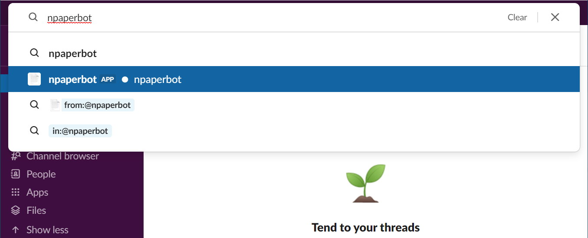
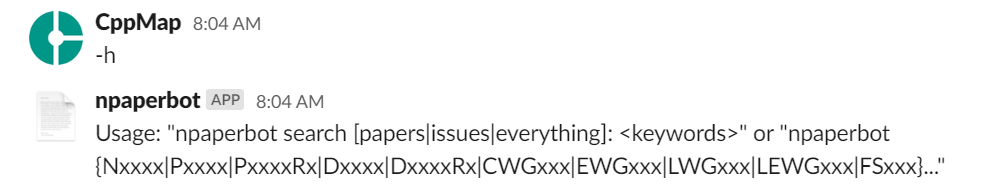
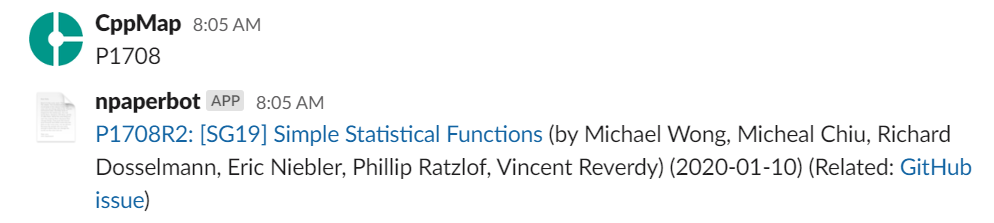
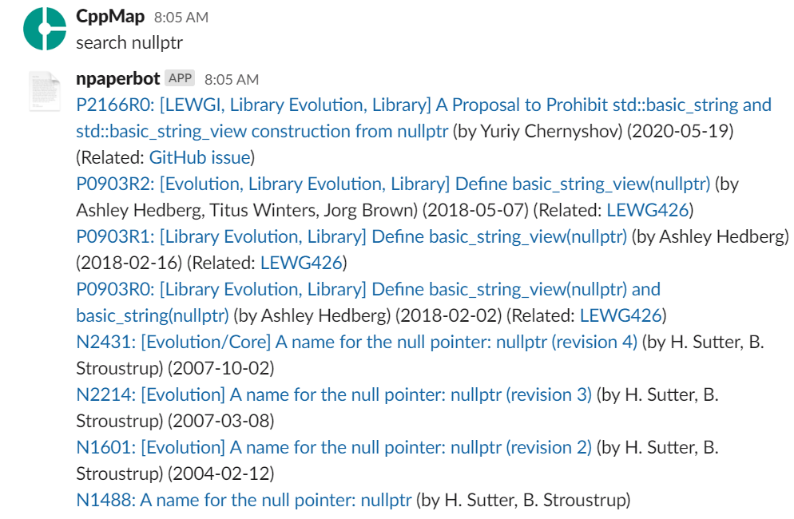
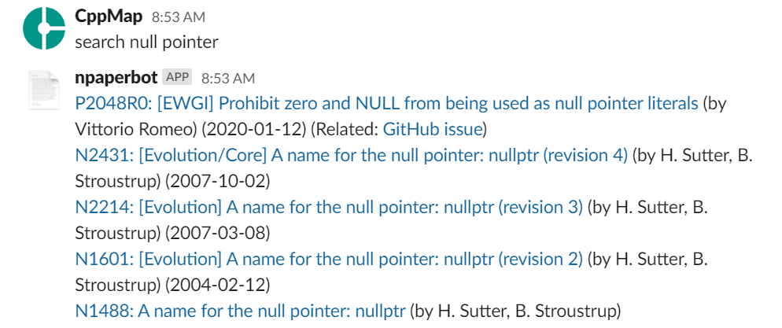
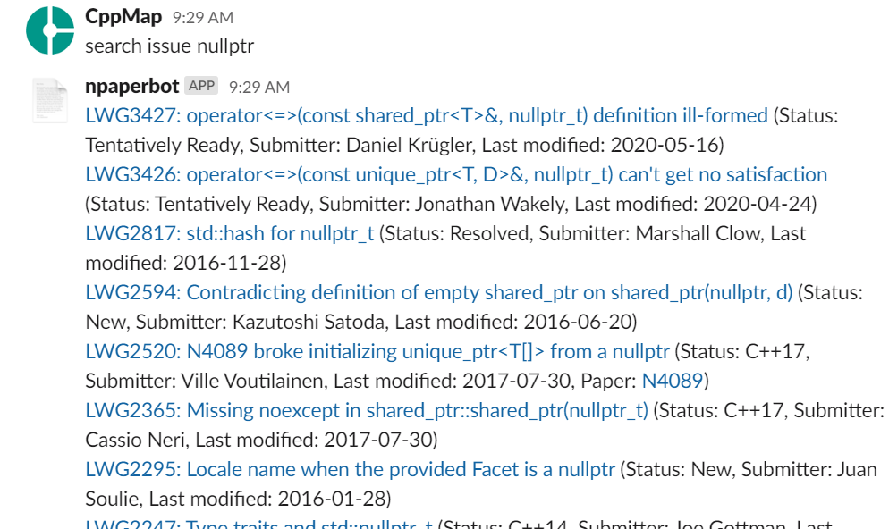

description: C++ 標準化委員会の文書検索に便利なツール「npaperbot」の紹介

# C++ 文書検索 bot

**npaperbot** は、C++ 標準化委員会の文書や Issues List を「番号」や「タイトルのキーワード」で検索できる Slack bot です。[Cpplang Slack](https://cppmap.github.io/learn/communities/#cpplang-slack) 上で稼働しています。

## 使い方

1. [Cpplang Slack](https://cppmap.github.io/learn/communities/#cpplang-slack) に登録します
2. Cpplang Slack の検索ボックスから npaperbot アプリを探して開きます
    
    
    
3. npaperbot とのダイレクトメッセージのやり取りができるようになります（ここでチャットした内容は他人には見えません）
    
    
    
4. `-h` でコマンドの使い方を表示します
    
    
    
    
5. `Nxxxx` のように文書番号を入力すると、最新のリビジョンへのリンク、著者情報、日付、GitHub Issue で進捗が管理されている最近の文書であればそのリンクを回答してくれます
    
    
    
    
6. `search` で文書タイトルのキーワード検索ができます。次の例では `nullptr` という語をタイトルに含む文書を検索し、8 件が見つかりました。一番古い N1488 は `nullptr` という用語が初めて登場した 2003 年の文書です。
    
    
    
7. `search` は完全一致検索なので、必要に応じて異なるパターンを試しましょう（`nullptr` では "null pointer" というタイトルは見つかりません）
    
    
    
8. デフォルトの `search` の検索対象はペーパーですが、`search issue` を使うと Issues List から、`search everything` を使うとペーパー・Issues 両方からの検索ができます。
    
    
    
