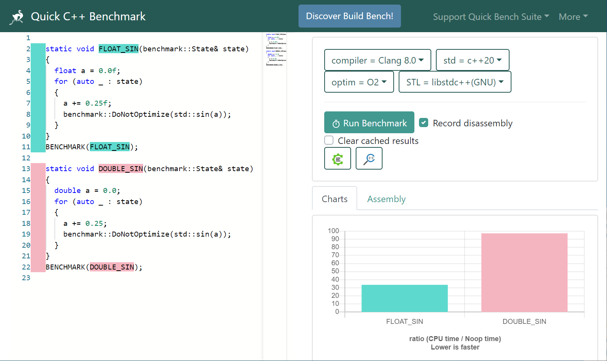
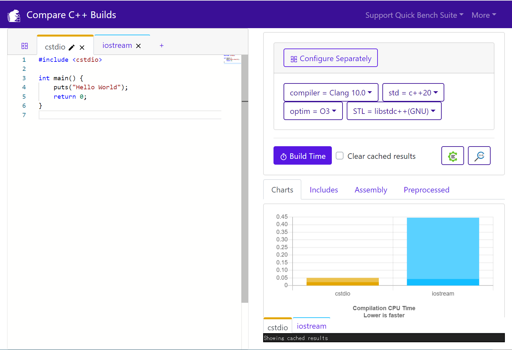

description: C++ プログラムのコンパイル・実行ができる Web サイトの紹介

# C++ オンラインコンパイラ

## 主要なオンラインコンパイラ

C++ プログラムのコンパイル、実行、共有ができる Web サイトです。

|                                                               | コンパイラ                                                                                         | 日本語入出力     | インタラクティブ   | 複数ファイル     |
|---------------------------------------------------------------|-----------------------------------------------------------------------------------------------|:------------:|:------------:|:------------:|
| [Wandbox](https://wandbox.org/)                               | <li>GCC 6.5.0 - 16.0</li><li>Clang 14.0 - 21.0</li>                               | :material-check: |            | :material-check: |
| [Compiler Explorer](https://godbolt.org/)<br>(Compiler モード) | <li>GCC 3.4.6 - 16.0</li><li>Clang 3.0 - 21.0</li><li>MSVC v19.14 - v19.latest</li><li>ICC 13.0.1 - 2021.10.0</li> | :material-check: |            | :material-check: |
| [Compiler Explorer](https://godbolt.org/)<br>(Execution モード) | <li>GCC 4.7.3 - 16.0</li><li>Clang 3.3 - 21.0</li><li>MSVC v19.20 - v19.latest</li><li>ICC 16.0.3 - 2021.10.0</li> | :material-check: |            | :material-check: |
| [repl.it](https://repl.it/languages/cpp)<br>(要アカウント登録) | <li>Clang 17.0.6</li>                                                                          | :material-check: | :material-check: | :material-check: |
| [C++ Shell](http://cpp.sh/)                                   | <li>Clang 16.0.0</li>                                                                            |            | :material-check: |            |
| [paiza.io](https://paiza.io/ja/projects/new?language=cpp)     | <li>Clang 10.0.0</li>                                                                          | :material-check: |            | :material-check: |
| [GDB Online](https://www.onlinegdb.com/)                      | <li>GCC 14.2.0</li>                                                                            | :material-check: | :material-check: | :material-check: |
| [Ideone](https://ideone.com/)                                 | <li>GCC 8.3.0</li>                                                                            | :material-check: |            |            |

## その他のツール

### Compiler Explorer
[Compiler Explorer](https://godbolt.org/) は、C, C++, Rust, Swift などのソースコードをコンパイルしてアセンブリを表示するオンラインコンパイラです。複数タブを使って、GCC, Clang, MSVC, ICC などのコンパイラや、コンパイルオプションを変えたときの結果を比較できます。

入力例
```c++
int square(int num)
{
    return num * num;
}
```

出力
```asm
square(int):
        push    rbp
        mov     rbp, rsp
        mov     DWORD PTR [rbp-4], edi
        mov     eax, DWORD PTR [rbp-4]
        imul    eax, DWORD PTR [rbp-4]
        pop     rbp
        ret
```

Compiler Explorer には、Web 上のファイルを `#include "URL"` でインクルードできる独自拡張機能があります。この機能を使うと、GitHub などに公開されているシングルヘッダライブラリをプログラムの中で簡単に使えます（例: https://godbolt.org/z/OV-vGQ）


### Quick Bench
[Quick Bench](http://quick-bench.com/) は、[google/benchmark](https://github.com/google/benchmark) による C++ プログラムの実行時間の計測と、その結果のビジュアライズができるオンラインコンパイラです。棒グラフによる比較、アセンブリの表示、グラフ画像のダウンロード、URL による結果のシェアなどの機能があります。

例: http://quick-bench.com/O1QdfCc73docKGKjaYBxWG6a9AU




### Build Bench
[Build Bench](https://build-bench.com/) は、異なる C++ ソースやビルドオプションどうしのビルド時間を比較できる Web サービスです。




### C++ Insights
[C++ Insights](https://cppinsights.io/) は、ラムダ式、range-based for, 構造化束縛などで何が起こっているのかを、プログラムを単純なソースコードに分解することで可視化するオンラインのツールです。  

入力例
```c++
#include <cstdio>

int main()
{
    const char arr[10]{2,4,6,8};

    for(const char& c : arr)
    {
      printf("c=%c\n", c);
    }
}
```
出力
```c++
#include <cstdio>

int main()
{
  const char arr[10] = {2, 4, 6, 8, '\0', '\0', '\0', '\0', '\0', '\0'};
  {
    char const (&__range1)[10] = arr;
    const char * __begin1 = __range1;
    const char * __end1 = __range1 + 10l;
    
    for( ; __begin1 != __end1; ++__begin1 )
    {
      const char & c = *__begin1;
      printf("c=%c\n", static_cast<int>(c));
    }
  }
}
```
